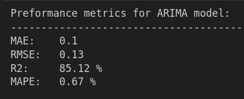

# **Capstone Project for Machine Learning Zoomcamp**  
**by Vesna Pop-Dimitrijoska**  

---

## **Project Title**  
**Time Series Forecasting on Web Traffic Data Using ARIMA, SARIMA, and PROPHET**     
        


---

## **Project Description**     
This project explores the end-to-end process of time series forecasting, from data preprocessing and model training to deployment. The models (ARIMA, SARIMA, and PROPHET) were evaluated on their ability to predict cumulative web traffic. The final solution is deployed via a Flask API and containerized using Docker for scalability and ease of use. This project highlights practical applications of machine learning in forecasting and demonstrates reproducibility through detailed steps and scripts.      
 
       
                      +-------------------------------+
                      |  Raw Data                    |
                      +-------------------------------+
                                   |
                                   v
                      +-------------------------------+
                      |       Data Preprocessing     |
                      | - Grouping by Date           |
                      | - Summing Sessions           |
                      | - Handling Missing Data/Outliers |
                      +-------------------------------+
                                   |
                                   v
                      +-------------------------------+
                      |      Feature Engineering     |
                      | - Log Scaling                |
                      | - Creating Lagged Features   |
                      +-------------------------------+
                                   |
                                   v
      +---------+             +----------+          +----------+
      |  ARIMA  |             |  SARIMA  |          | PROPHET  |
      +---------+             +----------+          +----------+
           |                       |                     |
           v                       v                     v
      +-------------------------------------------------------+
      |                    Trained Models                     |
      +-------------------------------------------------------+
                                   |
                                   v
                      +-------------------------------+
                      |       Model Evaluation        |
                      | - MAE, RMSE, R², MAPE         |
                      +-------------------------------+
                                   |
                                   v
                      +-------------------------------+
                      |    Flask API Deployment       |
                      +-------------------------------+
                                   |
                                   v
                      +-------------------------------+
                      |       Docker Container        |
                      +-------------------------------+     


### Time Series Forecasting

This project focuses on time series forecasting for cumulative web traffic across multiple devices (mobile, tablet, and desktop). The objective is to accurately predict future web traffic using statistical and machine learning models. Forecasting helps businesses optimize their resources, anticipate traffic surges, and make informed decisions.

Time series forecasting is a specialized type of machine learning problem that differs from traditional approaches because it accounts for sequential dependencies in data. Since this topic wasn't covered in the course, I am providing a more detailed explanation of this type of problem.

#### Key Differences in Time Series Forecasting

1. **Feature and Target Relationship**:  
   In time series forecasting, the feature and target are derived from the **same column**. For example, when forecasting future web traffic, historical traffic data itself serves as both the input (feature) and output (target) by creating lagged features.

2. **Sequential Dependency**:  
   Observations are not independent; each data point depends on past values (autocorrelation). Capturing these dependencies is critical for accurate predictions.

3. **Stationarity**:  
   Many time series models require stationarity, meaning that the statistical properties of the series (e.g., mean, variance) are constant over time. Techniques like differencing or detrending are often applied.

4. **Train-Test Splitting**:  
   Data splits must respect the temporal order. Methods like rolling window validation or time-based splits ensure the training data always precedes the test data.

#### Key Concepts in Time Series Forecasting

1. **Trend**: A long-term increase or decrease in the data.
2. **Seasonality**: Recurring patterns over fixed periods (e.g., daily, weekly).
3. **Lagged Features**: Historical values used as predictors for future values.
4. **Exogenous Variables**: External factors influencing the series (e.g., holidays).
5. **Evaluation Metrics**: Metrics like MAE, RMSE, and MAPE assess forecast accuracy.

#### Models Used in the Project

1. **ARIMA (AutoRegressive Integrated Moving Average)**:  
   A classic model effective for univariate data without significant seasonality.

2. **SARIMA (Seasonal ARIMA)**:  
   Extends ARIMA to handle seasonal patterns in the data.

3. **PROPHET**:  
   A robust and flexible model from Facebook, suitable for handling missing data, outliers, and seasonality.

#### Summary of Workflow

1. **Data Exploration**: Visualize the series to identify trends and patterns.
2. **Preprocessing**: Handle missing values, outliers, and ensure stationarity.
3. **Feature Engineering**: Create lagged features and include external variables.
4. **Model Selection**: Choose models like ARIMA, SARIMA, or PROPHET based on data characteristics.
5. **Validation and Testing**: Use time-aware splitting and relevant metrics.
6. **Forecasting and Analysis**: Predict future values and interpret results.

By leveraging time series models, businesses can effectively forecast web traffic, optimize resources, and respond to trends and seasonality.


---
#    
## **Project Files**

### **Project Folder Structure**    

├── EDA, DataPreprocessing, DataEngineering - WebTraffic - AllDevices.ipynb      
├── Time Series Forecasting - WebTraffic - AllDevices.ipynb      
├── train.py      
├── forecast.py      
├── Dockerfile      
├── requirements.txt      
├── clean_LA_web_traffic.csv      
├── df_total_final.csv      
└── best_model.pkl    
    
### **Notebooks**
1. **`EDA, DataPreprocessing, DataEngineering - WebTraffic - AllDevices.ipynb`**
   - **Content**:
     1. Data Cleaning
     2. Exploratory Data Analysis (EDA)
     3. Data Preprocessing
     4. Data Engineering
   - **Outcome**: Prepared a clean, stationary dataset ready for model training.

2. **`Time Series Forecasting - WebTraffic - AllDevices.ipynb`**
   - **Content**:      
     5. Model Training      
     6. Hyperparameter Optimization       
     7. Model Evaluation       
     8. Conclusions and Results        
   - **Outcome**: Trained and evaluated ARIMA, SARIMA, and PROPHET models.

### **Scripts**
1. **`train.py`**: Script for training the best model with the optimal parameters. Saves the model as a pickle file.
2. **`forecast.py`**: Script for generating forecasts using the trained model. Implements a Flask API to serve predictions.
3. **`Dockerfile`**: Containerizes the forecasting service for deployment.
4. **`requirements.txt`**: Lists all project dependencies.

### **Data**
The project utilizes two datasets:

1. **`clean_LA_web_traffic.csv`**: The initial dataset containing raw web traffic data. It includes the following columns:
   - **Date**: The date of the observation.
   - **Device Category**: The type of device used (e.g., desktop, mobile, tablet).
   - **Sessions**: The number of web sessions recorded for that date and device category.

2. **`df_total_final.csv`**: The cleaned and processed dataset used for modeling after data engineering. Key transformations include:
- Summing sessions across device categories to focus on total web traffic per date.
- Applying logarithmic scaling to the `Sessions` column to reduce variance and stabilize trends.
The cleaned dataset provides a stable and noise-reduced version of the original data, enabling more effective time series forecasting.     
**Shape of the dataset:** Nearly 5 years of daily data (2014–2018).
   - **Date**: The date of the observation.  
   - **Sessions**: The number of web sessions recorded summarised for all devices: **mobile, tablet, and desktop**.
 
### **Pickle File** (best_model.pkl)
The trained model is saved as best_model.pkl. This file contains the optimized model used for generating forecasts. Due to its size (approximately 27 MB), it was not uploaded here, but you can regenerate the model file by running the train.py script. The model will be saved in the project directory upon execution.

---
#      
## **Preprocessing and EDA**

### **Handling Outliers**
- Removed extreme outliers and imputed them with the mean.
- Addressed outliers by replacing problematic values (e.g., `0` values) to avoid introducing new ones after transformations.

### **Stationarity Testing**
- Applied transformations (e.g., logarithmic transformations) to make the data stationary.  
- Removed anomalous data for the year 2019 (sharp drops in traffic), which improved stationarity.

### **Decomposition Analysis**
Decomposed the web traffic time series into:
- **Trend**: No consistent upward/downward trend.  
- **Seasonality**: Clear weekly patterns in the data.  
- **Residuals**: Captured random noise after trend and seasonality removal.

---
#     
## **Results**

### **All Devices**
      
       


All models demonstrated **EXCELLENT** performance on the test dataset, as shown through visual predictions and evaluation metrics.

### **Key Metrics**
The models were evaluated using the following metrics:

1. **Mean Absolute Error (MAE)**: Measures the average absolute difference between actual and predicted values. Lower values indicate better performance.  
2. **Root Mean Squared Error (RMSE)**: Penalizes larger errors more heavily than MAE. Lower values are better.  
3. **R² (Coefficient of Determination)**: Represents how well the model explains the variance in the data.  
   - **R² Score Interpretation**:
     - **1.0**: Perfect prediction.
     - **0.0**: Model performs as poorly as predicting the mean.
     - Negative values: Model performs worse than predicting the mean.
   - A good R² score is typically **above 0.8** for time series forecasting tasks.
4. **Mean Absolute Percentage Error (MAPE)**: Measures the percentage error between actual and predicted values.  
   - **MAPE Interpretation**:
     - **0–10%**: Very accurate forecast.
     - **10–20%**: Good forecast.
     - **20–50%**: Reasonable forecast.
     - Above **50%**: Poor forecast.

### **Performance Summary**
- **ARIMA**: Best for simplicity and short-term predictions.
- **SARIMA**: Improved seasonal forecasting over ARIMA.
- **PROPHET**: Highly flexible and robust, especially for outliers and missing data.

**Note:** These metrics are calculated on the test split of the dataset. In a real forecasting model, such tests can only be done after the forecast period.

---
#    
## **Model Deployment**

### **Flask API**  
The forecasting model is deployed via a Flask API, allowing users to request future predictions.  

#### **Endpoint**
- **`POST /forecast`**  
  Expects a JSON payload with the following format:
```bash
  {
      "forecast_length": 5
  }
```

        
#### **Example Response**

```bash
{
    "forecast":[14.24873866464299,14.791480943683299,14.977861792878485,14.940939559872895,14.820453177941577]
}
```
         
### **How to Run the API**

#### **1. Run Locally**
```bash
   python forecast.py
```
Access the API at http://127.0.0.1:5000/forecast.

#### **2. Run with Docker**

   - #### **Build the Image:**
     ```bash
        docker build -t web-traffic-forecast .
     ```

   - #### **Run the Container:**
     ```bash
        docker run -p 5000:5000 web-traffic-forecast
     ```

   - #### **Test the API:**
     ```bash
        curl -X POST http://127.0.0.1:5000/forecast -H "Content-Type: application/json" -d '{"forecast_length": 5}'
     ```
---

### **Reproducibility**    

#### **Dependencies**          
The project dependencies are listed in requirements.txt. Install them with:
```bash
   pip install -r requirements.txt
```

#### **Docker Containerization** 
The project includes a **Dockerfile** for easy deployment.      
**Build and Run the Container:**
```bash
   docker build -t web-traffic-forecast .
   docker run -p 5000:5000 web-traffic-forecast
```
---
#    
## **Conclusion**
This project demonstrates the end-to-end process of time series forecasting using ARIMA, SARIMA, and PROPHET. The models achieved excellent results for cumulative web traffic prediction. The trained model is deployed via a Flask API and containerized for scalability using Docker.


---
#    
## **License**
MIT License
#
